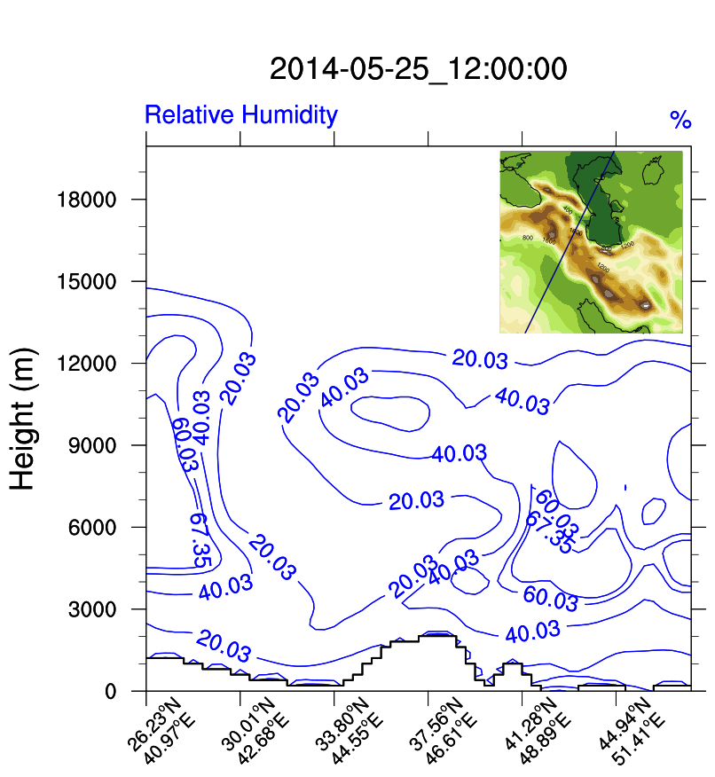
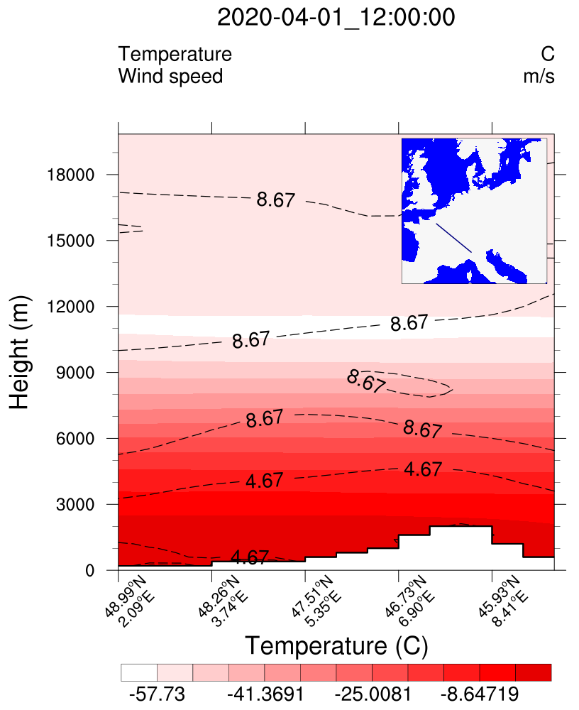

====================
Cross-section plots
====================

Like the contour plots, PostWRF provides a combination of three variables to be overlaid
 in a cross-section plot, besides the path of cross-section in a separate small plot inside the 
 main plot

.. note::
   Line colors, font sizes, etc., can be modified by changing the relevant variables in **namelist.wrf**

Example 1
==========

**A set of line contours with the path of the cross-section:**

.. role:: raw-html(raw)
    :format: html

| \============= CROSS SECTION PLOT \============== :raw-html:` ` 
| \=========================================== :raw-html:` `
| CROSSSECTION_ON-OFF            = 1

| CrossSection_path_on_off       = 1
| Topographic_map_on_off         = 1

| !!! 3D Variable_1 by line contours !!!
| 1st_var_on_off                 = 1
| 1st_var_name                   = rh
| 1st_var_intervals              = 20
| 1st_var_line_color             = blue
| 1st_var_line_thickness         = 0.5
| 1st_var_label_size             = 0.4

| !!! 3D Variable_2 by (broken) line contours !!!
| 2nd_var_on_off                 = 0
| 2nd_var_name                   = (ua^2 + va^2)^0.5
| 2nd_var_intervals              = 4
| 2nd_var_line_color             = black
| 2nd_var_line_thickness         = 0.5
| 2nd_var_label_size             = 0.5
| 2nd_var_brokenline_on_off      = 1

| !!! 3D Variable_3 by filled (colored) contours !!!
| 3rd_var_on_off                 = 0
| 3rd_var_name                   = pvo
| -------------------------------------------------------------------------------------------------

Output image at a specific time-slot in the WRF output is as bellow:

   
   Cross-section plot with line contours

Example 2
=========

**A set of line contours of a polynomial and a set of shaded contours, besides the path of the cross-section**

| \============= CROSS SECTION PLOT \============== :raw-html:` ` 
| \=========================================== :raw-html:` `
| CROSSSECTION_ON-OFF            = 1

| CrossSection_path_on_off       = 1
| Topographic_map_on_off         = 0

| !!! 3D Variable_1 by line contours !!!
| 1st_var_on_off                 = 0
| 1st_var_name                   = rh
| 1st_var_intervals              = 20
| 1st_var_line_color             = blue
| 1st_var_line_thickness         = 0.5
| 1st_var_label_size             = 0.4

| !!! 3D Variable_2 by (broken) line contours !!!
| 2nd_var_on_off                 = 1
| 2nd_var_name                   = (ua^2 + va^2)^0.5
| 2nd_var_intervals              = 4
| 2nd_var_line_color             = black
| 2nd_var_line_thickness         = 0.5
| 2nd_var_label_size             = 0.5
| 2nd_var_brokenline_on_off      = 1

| !!! 3D Variable_3 by filled (colored) contours !!!
| 3rd_var_on_off                 = 1
| 3rd_var_name                   = tc
| -------------------------------------------------------------------------------------------------

Output image at a specific time-slot in the WRF output is as bellow:

   
   Cross-section plot with shaded contours

Example 3
=========

**Average (12 hours) plots of Two sets of line contours, shown as a panel plot**

| \============= CROSS SECTION PLOT \============== :raw-html:` ` 
| \=========================================== :raw-html:` `
| CROSSSECTION_ON-OFF            = 1

| CrossSection_path_on_off       = 0
| Topographic_map_on_off         = 0

| !!! 3D Variable_1 by line contours !!!
| 1st_var_on_off                 = 1
| 1st_var_name                   = rh
| 1st_var_intervals              = 20
| 1st_var_line_color             = blue
| 1st_var_line_thickness         = 0.5
| 1st_var_label_size             = 0.4

| !!! 3D Variable_2 by (broken) line contours !!!
| 2nd_var_on_off                 = 1
| 2nd_var_name                   = tv
| 2nd_var_intervals              = 10
| 2nd_var_line_color             = red
| 2nd_var_line_thickness         = 0.5
| 2nd_var_label_size             = 0.5
| 2nd_var_brokenline_on_off      = 0

| !!! 3D Variable_3 by filled (colored) contours !!!
| 3rd_var_on_off                 = 0
| 3rd_var_name                   = tc
| -------------------------------------------------------------------------------------------------

Panel plot is a capability of PostWRF which must be set in
the *General settings* section of namelist.wrf

| \============== GENERAL SETTINGS \=============== :raw-html:` ` 
| \============================================ :raw-html:` `
| spin-up_time (hours)            = 6
| averaging_on_off                = 1
| average_time (hours)            = 12
| panel_plot__on_off              = 1
| panel_plot__rows_number         = 1
| panel_plot__columns_number      = 2
| smooth_maps_on_off              = 1
| map_borderline_color            = black
| map_borderline_thickness        = 0.7
| map_filled_ocean_on_off         = 1
| map_gridlines_on_off            = 1
| plot_titles_on_off              = 1
| -------------------------------------------------------------------------------------------------

Output image at a specific time-slot in the WRF output is as bellow:

.. figure:: images/cross3.png
   :scale: 60 %
   :alt: map to buried treasure
   
   Panel plots of cross-sections
