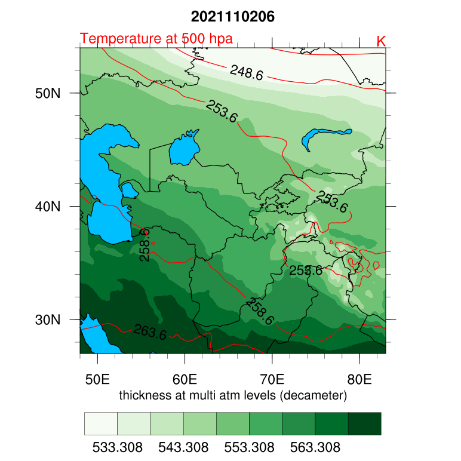

===================
ERA5 Contour plots
===================

A combination of three variables, as well as wind vectors and location markers,
could be plotted by PostWRF.
Moreover, the user can plot the whole domain or a specified sub-domain by turning on **ERA5_SubDomain_on_off** and setting
the relevant variables (Min_lat, Max_lat, Min_lon, and Max_lon)

.. note::
   ERA5 data must be downloaded as NetCDF format

Example 1
==========

**A group of line contours (temperature) overlaid on a group of filled contours (geopotential thickness between 500 and 1000 hpa)**

.. role:: raw-html(raw)
    :format: html

| \============== ERA5 CONTOUR PLOT \=============== :raw-html:` ` 
| \============================================= :raw-html:` ` 
| ERA5_ON_OFF                      = 1

| !!! Variable_1 by line contours !!!
| 1st_ERA5_Var_on_off              = 1
|  1st_ERA5_Var_name               = t
|  1st_ERA5_Var_pressure_level     = 500
|  1st_ERA5_Var_intervals          = 5
|  1st_ERA5_Var_line_color         = red
|  1st_ERA5_Var_line_thickness     = 0.5
|  1st_ERA5_Var_label_size         = 0.3

| !!! Variable_2 by (broken) line contours !!!
| 2nd_ERA5_Var_on_off              = 0
|  2nd_ERA5_Var_name               = t+r
|  2nd_ERA5_Var_pressure_level     = 333
|  2nd_ERA5_Var_intervals          = 0
|  2nd_ERA5_Var_line_color         = red
|  2nd_ERA5_Var_line_thickness     = 0.8
|  2nd_ERA5_Var_label_size         = 0.3
|  2nd_ERA5_Var_brokenline_on_off  = 1

| !!! Variable_3 by filled (colored) contours !!!
| 3rd_ERA5_Var_on_off              = 1
|  3rd_ERA5_Var_name               = (z-z)/98.1
|  3rd_ERA5_Var_pressure_level     = 500, 1000

| Wind_ERA5_on_off                 = 0
|  Wind_ERA5_pressure_level        = 333
|  Wind_ERA5_speed (m/s)           = 10
|  Wind_ERA5_density               = 0.5
|  Wind_ERA5_color                 = blue
|  Wind_ERA5_thickness             = 0.5

| ERA5_point_mark_on_off           = 0
|  ERA5_labels_on_off              = 1
|  ERA5_labels_size                = 0.3
|  ERA5_labels_color               = black
|  ERA5_Shapefile_on_off            = 0
|  ERA5_shapefile_path             = /home/anikfal/shapefiles/anzali_swamp.shp

| ERA5_SubDomain_on_off            = 0
|  Min_lat                         = 30
|  Max_lat                         = 50
|  Min_lon                         = 60
|  Max_lon                         = 70
| -----------------------------------------------------------------------------

Output image at a specific time-slot in the ERA5 NetCDF file is as bellow:

   
   Overlaid line contours (temperature) on filled contours (thickness)

Please notice that unlike the WRF outputs, for ERA5 files, pressure levels are not interpolated.
Therefor if the input pressure level is not in the file (e.g. 333), the nearest pressure level to this value will be selected.

Example 2
==========

**Similar to example one, but with overlaid wind vectors, with sub-domain**

Same as WRF outputs, location labels, as well as shapefiles can also be overlaid on the plots

| \============== ERA5 CONTOUR PLOT \=============== :raw-html:` `
| \============================================= :raw-html:` `
| ERA5_ON_OFF                      = 1

| !!! Variable_1 by line contours !!!
| 1st_ERA5_Var_on_off              = 1
|  1st_ERA5_Var_name               = t
|  1st_ERA5_Var_pressure_level     = 500
|  1st_ERA5_Var_intervals          = 5
|  1st_ERA5_Var_line_color         = red
|  1st_ERA5_Var_line_thickness     = 0.5
|  1st_ERA5_Var_label_size         = 0.3

| !!! Variable_2 by (broken) line contours !!!
| 2nd_ERA5_Var_on_off              = 0
|  2nd_ERA5_Var_name               = t+r
|  2nd_ERA5_Var_pressure_level     = 333
|  2nd_ERA5_Var_intervals          = 0
|  2nd_ERA5_Var_line_color         = red
|  2nd_ERA5_Var_line_thickness     = 0.8
|  2nd_ERA5_Var_label_size         = 0.3
|  2nd_ERA5_Var_brokenline_on_off  = 1

| !!! Variable_3 by filled (colored) contours !!!
| 3rd_ERA5_Var_on_off              = 1
|  3rd_ERA5_Var_name               = (z-z)/98.1
|  3rd_ERA5_Var_pressure_level     = 500, 1000

| Wind_ERA5_on_off                 = 1
|  Wind_ERA5_pressure_level        = 500
|  Wind_ERA5_speed (m/s)           = 7
|  Wind_ERA5_density               = 0.5
|  Wind_ERA5_color                 = yellow
|  Wind_ERA5_thickness             = 0.5

| ERA5_point_mark_on_off           = 0
|  ERA5_labels_on_off              = 1
|  ERA5_labels_size                = 0.3
|  ERA5_labels_color               = black
|  ERA5_Shapefile_on_off            = 0
|  ERA5_shapefile_path             = /home/anikfal/shapefiles/anzali_swamp.shp

| ERA5_SubDomain_on_off            = 1
|  Min_lat                         = 30
|  Max_lat                         = 50
|  Min_lon                         = 55
|  Max_lon                         = 65
| -----------------------------------------------------------------------------

Output image at a specific time-slot in the WRF output is as bellow:

.. figure:: images/era_contour2.png
   :scale: 70 %
   :alt: map to buried treasure
   
   Shaded and line contours, overlaid by wind vectors, plotted over a sub-domain

Example 3
==========

**Panel plot of a shaded and a line contour**

| \============== ERA5 CONTOUR PLOT \=============== :raw-html:` ` 
| \============================================= :raw-html:` `
| ERA5_ON_OFF                      = 1

| !!! Variable_1 by line contours !!!
| 1st_ERA5_Var_on_off              = 0
|  1st_ERA5_Var_name               = t
|  1st_ERA5_Var_pressure_level     = 500
|  1st_ERA5_Var_intervals          = 5
|  1st_ERA5_Var_line_color         = red
|  1st_ERA5_Var_line_thickness     = 0.5
|  1st_ERA5_Var_label_size         = 0.3

| !!! Variable_2 by (broken) line contours !!!
| 2nd_ERA5_Var_on_off              = 0
|  2nd_ERA5_Var_name               = t+r
|  2nd_ERA5_Var_pressure_level     = 333
|  2nd_ERA5_Var_intervals          = 0
|  2nd_ERA5_Var_line_color         = red
|  2nd_ERA5_Var_line_thickness     = 0.8
|  2nd_ERA5_Var_label_size         = 0.3
|  2nd_ERA5_Var_brokenline_on_off  = 1

| !!! Variable_3 by filled (colored) contours !!!
| 3rd_ERA5_Var_on_off              = 1
|  3rd_ERA5_Var_name               = vo
|  3rd_ERA5_Var_pressure_level     = 500

| Wind_ERA5_on_off                 = 0
|  Wind_ERA5_pressure_level        = 500
|  Wind_ERA5_speed (m/s)           = 7
|  Wind_ERA5_density               = 0.5
|  Wind_ERA5_color                 = yellow
|  Wind_ERA5_thickness             = 0.5

| ERA5_point_mark_on_off           = 0
|  ERA5_labels_on_off              = 1
|  ERA5_labels_size                = 0.3
|  ERA5_labels_color               = black
|  ERA5_Shapefile_on_off            = 0
|  ERA5_shapefile_path             = /home/anikfal/shapefiles/anzali_swamp.shp

| ERA5_SubDomain_on_off            = 0
|  Min_lat                         = 30
|  Max_lat                         = 50
|  Min_lon                         = 55
|  Max_lon                         = 65
| -----------------------------------------------------------------------------

Panel plot is a capability of PostWRF which must be set in
the *General settings* section of namelist.wrf

| \============== GENERAL SETTINGS \=============== :raw-html:` ` 
| \============================================= :raw-html:` `
| spin-up_time (hours)            = 6
| averaging_on_off                = 1
|  average_time (hours)            = 12
| panel_plot__on_off              = 1
|  panel_plot__rows_number         = 2
|  panel_plot__columns_number      = 3
| smooth_maps_on_off              = 1
| map_borderline_color            = black
| map_borderline_thickness        = 0.7
| map_filled_ocean_on_off         = 1
| map_gridlines_on_off            = 1
| plot_titles_on_off              = 0
| -------------------------------------------------------------------------------------------------

Output images of vorticity by 12 hour average, as panel plots:

   
   Contour maps as panel plots
