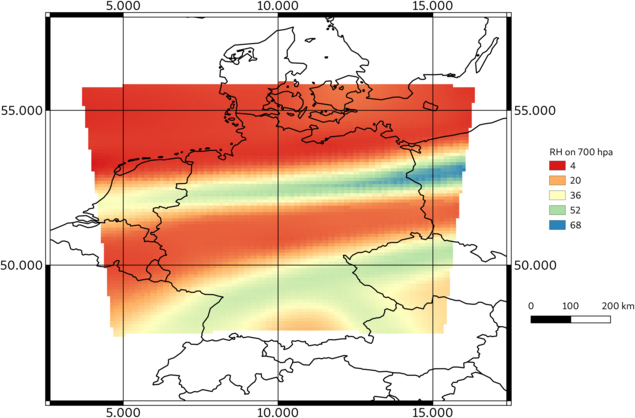

=====================
Conversion to GeoTIFF
=====================

PostWRF provides conversion of a desired variable (polynomial of variables) of 
WRF output to GeoTIFF format.

For running this capability of PostWRF,it is necessary to have
the `gdal tool <https://gdal.org/>`_ installed:

.. code-block:: bash

    sudo dnf install gdal

The section corresponding to the GeoTIFF conversion in namelist.wrf must be enabled:

.. role:: raw-html(raw)
    :format: html

.. |s| unicode:: U+00A0 .. non-breaking space

+-----------------------------------------------------------------------------------------------------+
| \============== CONVERT TO GEOTIFF \================ :raw-html:` `                             |
| \============================================== :raw-html:` `                                  |
| Geotiff_ON_OFF |s| |s| |s| |s| |s| |s| |s| |s| |s| |s| |s| |s| |s| |s| = 1 :raw-html:` `       |
| Variable_name_to_Geotiff |s| |s| |s| |s| |s| |s| |s| = rh :raw-html:` `                        |
| Geotiff_pressure_level |s| |s| |s| |s| |s| |s| |s| |s| |s| |s| = 700 :raw-html:` `             |
+-----------------------------------------------------------------------------------------------------+

After running postwrf.sh, the converted tif files will be saved in a folder with a name
similar to the name of the file selected

The generated GeoTIFF files could be processed and visualized by a GIS software:

.. +-----------------------------------------------------------------------------+
.. | .. figure:: images/geo_post_germany.png                                     |
.. |   :scale: 90 %                                                              |
.. |   :alt: map to buried treasure                                              |
.. |                                                                             |
.. | Relative humidity from WRF output at 700 hpa                                |
.. |                                                                             |
.. | Converted to GeoTIFF by PostWRF and visualized by the QGIS software         |
.. +-----------------------------------------------------------------------------+

   Relative humidity from WRF output at 700hpa, converted to GeoTIFF by PostWRF and visualized by the QGIS software
