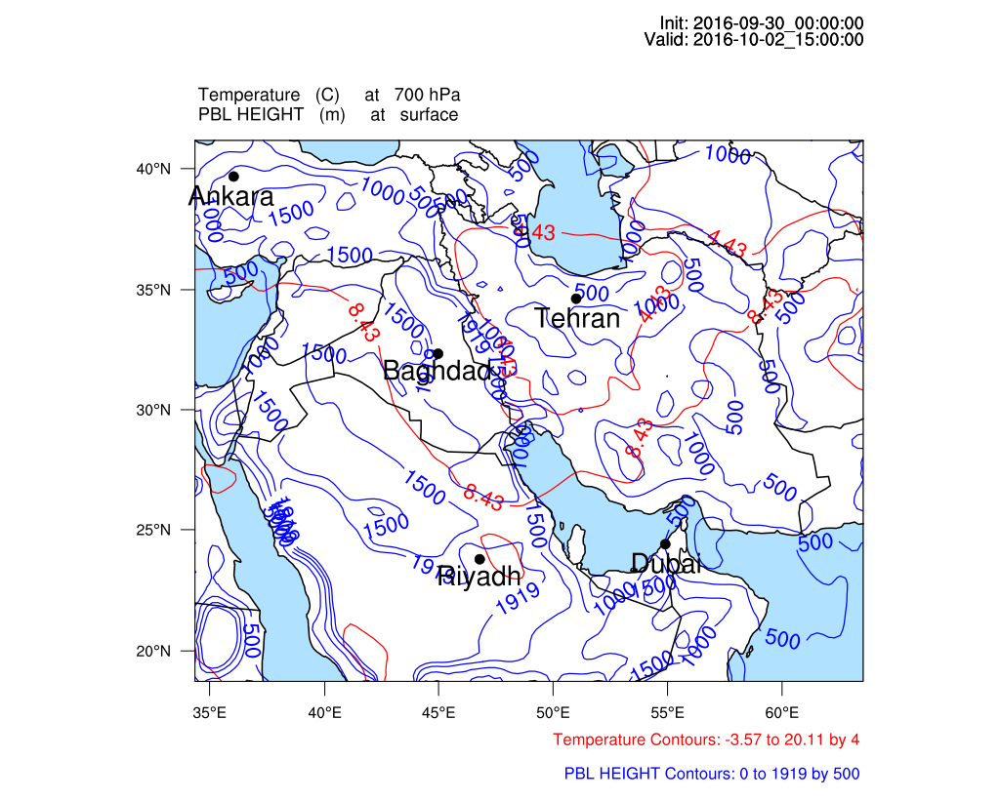
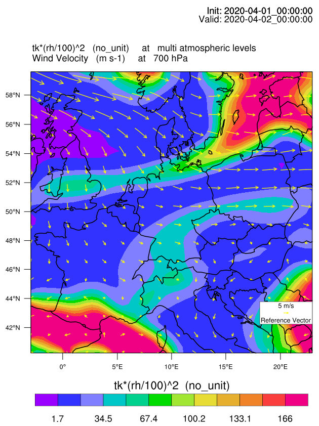
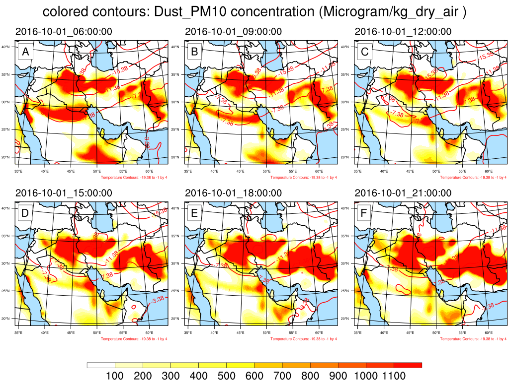

=============
Contour plots
=============

A combination of three variables, as well as wind vectors and location markers,
could be plotted by PostWRF.

Example 1
==========

**Two line contours plus the locations of some points
(specified in 'Data extraction' section of namelist.wrf):**

.. role:: raw-html(raw)
    :format: html

| \================ CONTOUR PLOT \================= :raw-html:` ` 
| \============================================= :raw-html:` ` 
| CONTOUR_ON_OFF                 = 1

| !!! Variable_1 by line contours !!!
| 1st_Variable_on_off            = 1
| 1st_Variable_name              = tc
| 1st_Variable_pressure_level    = 700
| 1st_Variable_intervals         = 4
| 1st_Variable_line_color        = red
| 1st_Variable_line_thickness    = 0.5
| 1st_Variable_label_size        = 0.5

| !!! Variable_2 by (broken) line contours !!!
| 2nd_Variable_on_off            = 1
| 2nd_Variable_name              = PBLH
| 2nd_Variable_pressure_level    = 0
| 2nd_Variable_intervals         = 500
| 2nd_Variable_line_color        = blue
| 2nd_Variable_line_thickness    = 0.5
| 2nd_Variable_label_size        = 0.5
| 2nd_Variable_brokenline_on_off = 0

| !!! Variable_3 by filled (colored) contours !!!
| 3rd_Variable_on_off            = 0
| 3rd_Variable_name              = pvo
| 3rd_Variable_pressure_level    = 0,

| Wind_Vectors_on_off            = 0
| Wind_Vectors_pressure_level    = 700
| Wind_Vectors_speed (m/s)       = 5
| Wind_Vectors_density           = 0.5
| Wind_Vectors_color             = blue
| Wind_Vectors_thickness         = 0.5

| Location_point_mark_on_off     = 1
| Location_labels_on_off         = 1
| Location_labels_size           = 0.2
| Location_labels_color          = black
| Shapefile_on-off               = 0
| Shapefile_path                 = /home/ah/postwrf/modules/iran_provinces/all.shp
| -------------------------------------------------------------------------------------------------

Output image at a specific time-slot in the WRF output is as bellow:

Example 2
==========

**Shaded contour of a polynomial (tk * (rh/100)^2)**

During the processing, several questions, such as the color pattern of
the contours, name and unit of the polynomial, and file format will be asked from the usr.

The user can specify a pressure level for each variable names, with exactly
the same number as the variable names (2 values, corresponded to tk and rh for this example).
If only one value is set for *3rd_Variable_pressure_level*, all the variables
(tk and rh) will be plotted at the same pressure level.

| \================ CONTOUR PLOT \================= :raw-html:` ` 
| \============================================= :raw-html:` ` 
| CONTOUR_ON_OFF                 = 1

| !!! Variable_1 by line contours !!!
| 1st_Variable_on_off            = 0
| 1st_Variable_name              = tc
| 1st_Variable_pressure_level    = 500
| 1st_Variable_intervals         = 3
| 1st_Variable_line_color        = red
| 1st_Variable_line_thickness    = 0.7
| 1st_Variable_label_size        = 0.7

| !!! Variable_2 by (broken) line contours !!!
| 2nd_Variable_on_off            = 0
| 2nd_Variable_name              = T2
| 2nd_Variable_pressure_level    = 0
| 2nd_Variable_intervals         = 0
| 2nd_Variable_line_color        = brown
| 2nd_Variable_line_thickness    = 0.7
| 2nd_Variable_label_size        = 0.7
| 2nd_Variable_brokenline_on_off = 1

| !!! Variable_3 by filled (colored) contours !!!
| 3rd_Variable_on_off            = 1
| 3rd_Variable_name              = tk * (rh/100)^2
| 3rd_Variable_pressure_level    = 650, 700

| Wind_Vectors_on_off            = 1
| Wind_Vectors_pressure_level    = 700
| Wind_Vectors_speed (m/s)       = 5
| Wind_Vectors_density           = 0.5
| Wind_Vectors_color             = yellow
| Wind_Vectors_thickness         = 0.7

| Location_point_mark_on_off     = 1
| Location_labels_on_off         = 1
| Location_labels_size           = 0.2
| Location_labels_color          = black
| Shapefile_on-off               = 0
| Shapefile_path                 = /home/ah/postwrf/modules/iran_provinces/all.shp
| -------------------------------------------------------------------------------------------------

Output image at a specific time-slot in the WRF output is as bellow:

Example 3
==========

**Panel plot of a shaded and a line contour**

| \================ CONTOUR PLOT \================= :raw-html:` ` 
| \============================================= :raw-html:` `
| CONTOUR_ON_OFF                 = 1

| !!! Variable_1 by line contours !!!
| 1st_Variable_on_off            = 1
| 1st_Variable_name              = tc
| 1st_Variable_pressure_level    = 500
| 1st_Variable_intervals         = 4
| 1st_Variable_line_color        = red
| 1st_Variable_line_thickness    = 0.7
| 1st_Variable_label_size        = 0.7

| !!! Variable_2 by (broken) line contours !!!
| 2nd_Variable_on_off            = 0
| 2nd_Variable_name              = T2
| 2nd_Variable_pressure_level    = 0
| 2nd_Variable_intervals         = 0
| 2nd_Variable_line_color        = brown
| 2nd_Variable_line_thickness    = 0.7
| 2nd_Variable_label_size        = 0.7
| 2nd_Variable_brokenline_on_off = 1

| !!! Variable_3 by filled (colored) contours !!!
| 3rd_Variable_on_off            = 1
| 3rd_Variable_name              = dust_pm10
| 3rd_Variable_pressure_level    = 0

| Wind_Vectors_on_off            = 0
| Wind_Vectors_pressure_level    = 700
| Wind_Vectors_speed (m/s)       = 5
| Wind_Vectors_density           = 0.5
| Wind_Vectors_color             = yellow
| Wind_Vectors_thickness         = 0.7

| Location_point_mark_on_off     = 0
| Location_labels_on_off         = 1
| Location_labels_size           = 0.2
| Location_labels_color          = black
| Shapefile_on-off               = 0
| Shapefile_path                 = /home/ah/postwrf/modules/iran_provinces/all.shp
| -------------------------------------------------------------------------------------------------

Panel plot is a capability of PostWRF which must be set in
the *General settings* section of namelist.wrf

| \============== GENERAL SETTINGS \=============== :raw-html:` ` 
| \============================================= :raw-html:` `
| spin-up_time (hours)            = 12
| averaging_on_off                = 0
| average_time (hours)            = 12
| panel_plot__on_off              = 1
| panel_plot__rows_number         = 2
| panel_plot__columns_number      = 3
| smooth_maps_on_off              = 1
| map_borderline_color            = black
| map_borderline_thickness        = 0.7
| map_filled_ocean_on_off         = 1
| map_gridlines_on_off            = 1
| plot_titles_on_off              = 0
| -------------------------------------------------------------------------------------------------

Output image at a specific time-slot in the WRF output is as bellow:

