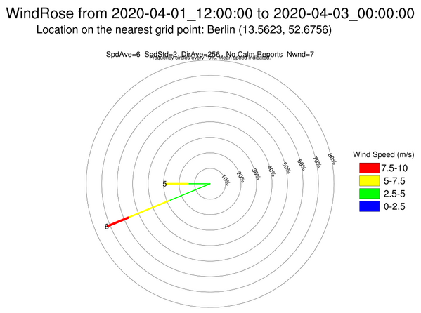
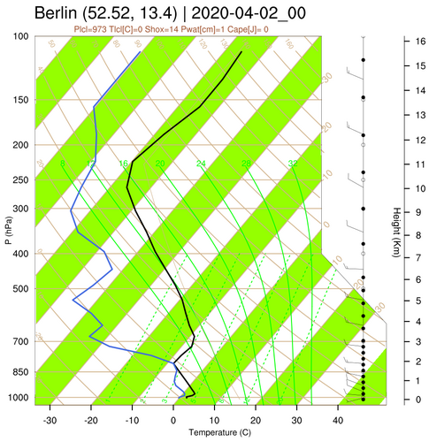

========================
Meteorological diagrams
========================

**Plotting two meteorological diagrams is provided by PostWRF:**

Wind-rose
=========

.. role:: raw-html(raw)
    :format: html

| \=============== WIND ROSE DIAGRAM \================ :raw-html:` ` 
| \================================================== :raw-html:` `
| windrose_On-Off                 = 1
| wind_location_name              = Berlin
| wind_location_latitude          = 52.52
| wind_location_longitude         = 13.40
| -----------------------------------------------------------------------------------

Output image at a specific time-slot in the WRF output is as bellow:

SkewT
=====

| \=============== SKEWT DIAGRAM \================ :raw-html:` ` 
| \============================================== :raw-html:` `
| windrose_On-Off                  = 1
| skewt_location_name              = Berlin
| skewt_location_latitude          = 52.52
| skewt_location_longitude         = 13.40
| -----------------------------------------------------------------------------------

Output image at a specific time-slot in the WRF output is as bellow:

