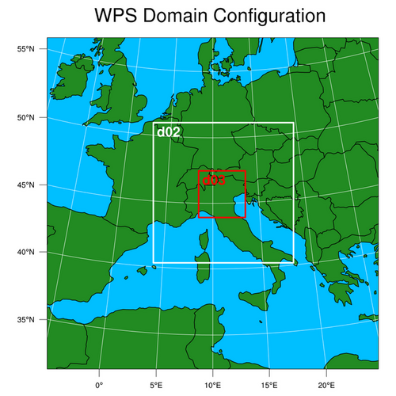
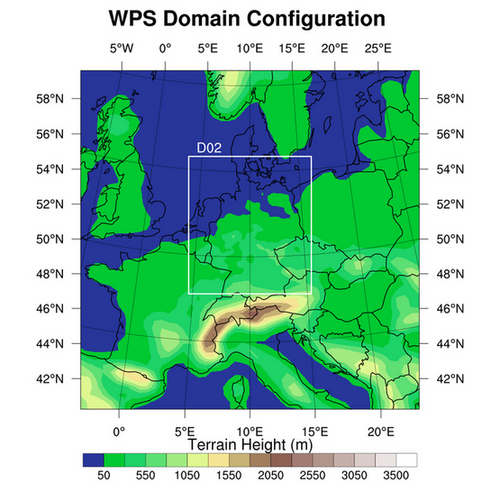

====================
Plotting WRF domains
====================

Two methods are available in PostWRF to plot the WRF's simulation domain:

Method 1
========

**Using namelist.wps from the WRF Preprocessing System (WPS)**

In this method a schematic map of the simulation domain will be plotted.

.. role:: raw-html(raw)
    :format: html

| \=============== DOMAIN MAP \================ :raw-html:` ` 
| \=========================================== :raw-html:` `
| Domain_On-Off                    = 1

| namelist.wps_path (schematic)    = /home/anikfal/wrf/WPS/namelist.wps
| background_color (schematic)     = forestgreen
| lables_On-Off (schematic)        = 0

| +Domain_on_off (topography)      = 0
| +number_of_domains (topography)  = 2
| +box_color                       = white
| -------------------------------------------------------------------------------------

Output image at a specific time-slot in the WRF output is as bellow:

Method 2
========

**Using the model's outputs, which could be the outputs of geogrid.exe, metgrid.exe, or wrf.exe**

In this method the WRF simulation domain will be plotted
as a topography map.

| \=============== DOMAIN MAP \================ :raw-html:` ` 
| \=========================================== :raw-html:` `
| Domain_On-Off                    = 1

| namelist.wps_path (schematic)    = /home/anikfal/wrf/WPS/namelist.wps
| background_color (schematic)     = forestgreen
| lables_On-Off (schematic)        = 0

| +Domain_on_off (topography)      = 1
| +number_of_domains (topography)  = 2
| +box_color                       = white
| -------------------------------------------------------------------------------------

Output image at a specific time-slot in the WRF output is as bellow:

