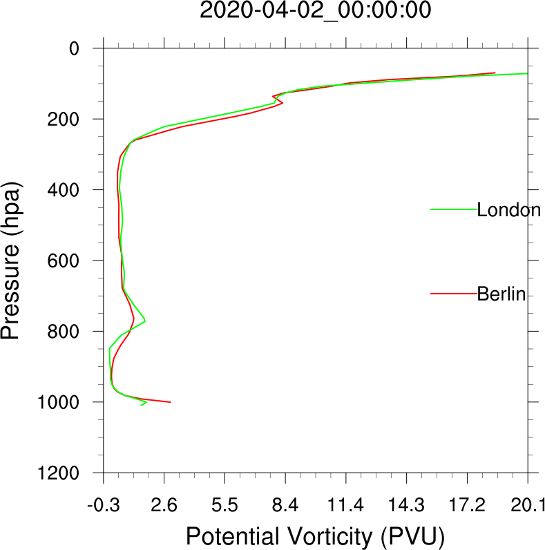

================
Data extraction
================

The very first step in running PostWRF is modifying namelist.wrf:

.. code-block:: bash

    vi namelist.wrf

The first section in namelist.wrf corresponds to the data extraction:

.. role:: raw-html(raw)
    :format: html

.. |s| unicode:: U+00A0 .. non-breaking space

+-------------------------------------------------------------------------------------------------------------------------------+
| \=============== DATA EXTRACTION \=================                                                                           |
| Extract_On-Off |s| |s| |s| |s| |s| |s| |s| |s| |s| |s| |s| |s| |s| |s| = 1 :raw-html:` `                                 |
| WRF_variable_name |s| |s| |s| |s| |s| |s| |s| |s| |s| = pvo :raw-html:` `                                                |
| Location_names |s| |s| |s| |s| |s| |s| |s| |s| |s| |s| |s| |s| |s| = Berlin, London :raw-html:` `                        |
| Location_latitudes |s| |s| |s| |s| |s| |s| |s| |s| |s| |s| |s| = 52.52, 51.51 :raw-html:` `                              |
| Location_longitudes |s| |s| |s| |s| |s| |s| |s| |s| |s| |s| = 13.40, 00.10        :raw-html:` `                          |
|                                                                                                                               |
| \+Vertical_profile_plot_on_off |s| |s|  = 0     :raw-html:` `                                                            |
| \+Vprofile_X_axis_decimals     |s| |s| |s| |s| = 3                                                                            |
+-------------------------------------------------------------------------------------------------------------------------------+

After modifying namelist.wrf, run the software by:

.. code-block:: bash

    ./postwrf.sh

| During the run process, the method of data extraction (interpolation) will be inquired. Three interpolation methods are available:

1. Nearest point
2. Bilinear
3. IDW

| The Output as an ascii file will be saved in a folder with a name similar to the name of the selected WRF file:

.. csv-table:: WRF output variable: pvo (Potential Vorticity) - unit_scale: PVU
   :file: values-pvo-Bilinear
..    :widths: 40, 20, 20

If +Vertical_profile_plot_on_off is set to 1, the vertical profiles of the locations (Berlin and London) 
will be plotted:

