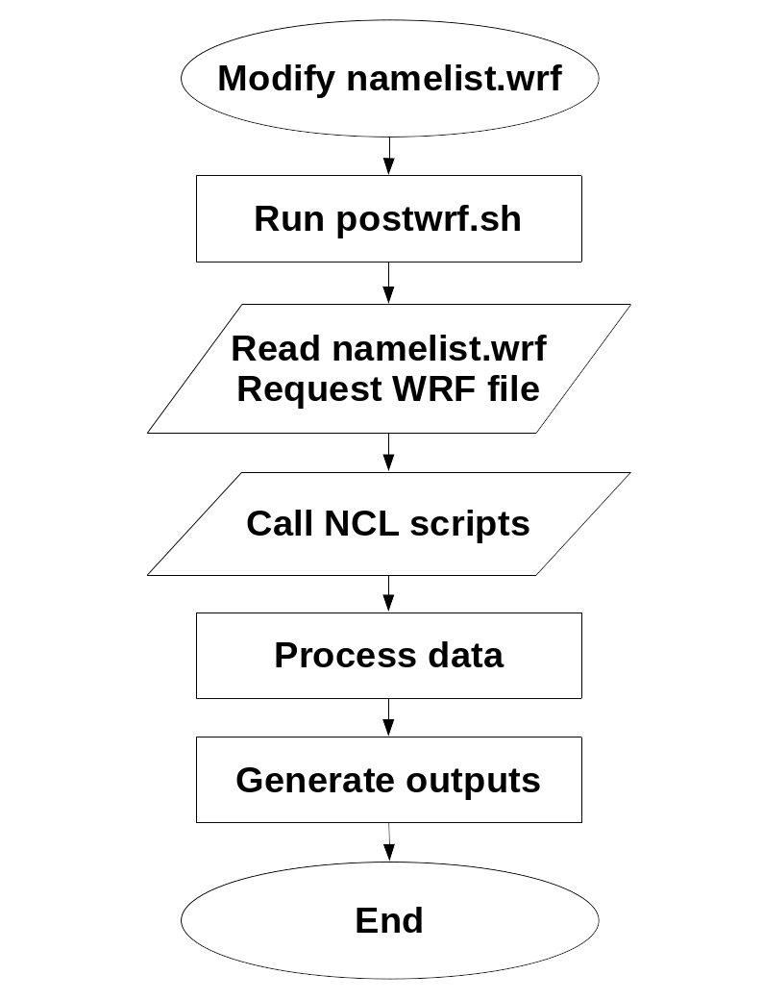

========
Overview
========
For each post-processing task, there are one or more corresponding NCL scripts which are
automatically modified by the Linux shell scripts. The end user does not need to make any direct
modifications on the NCL scripts, rather, the Linux shell scripts act as
proxies between NCL codes and the end user, in modifying the NCL codes
with regard to some primary input data, provided by the user.

Software structure
=====

The processing steps through PostWRF is depicted below as a flowchart diagram:

