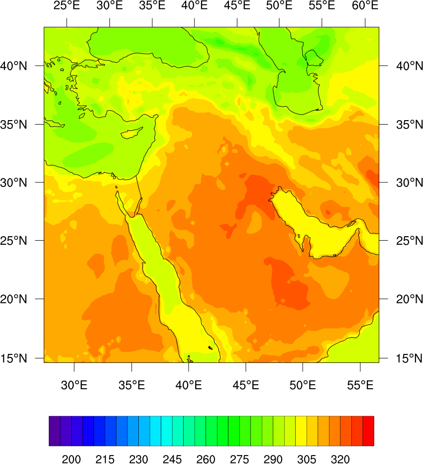

========================
RTTOV model input/output
========================

`RTTOV (Radiative Transfer for TOVS) <https://nwp-saf.eumetsat.int/site/software/rttov>`_ is a fast radiative transfer model to simulate imagery from about 100 satellite sensors. It is a FORTRAN 90 code for simulating satellite radiances, designed to be incorporated within user applications.

PostWRF can prepare RTTOV input file from the WRF output variables, and convert the RTTOV outputs from ASCII to other formats, such as NetCDF, PNG, and GeoTIFF.

Input data preparation
======================

**Generating the RTTOV input data:**

PostWRF can generate RTTOV input files from a WRF output, on specified time-slots, for all of the WRF horizontal grid points. In the current PostWRF software (V1.2), aerosol impact on the optical depth is supported only for dust particles. The advanced user can modify the NCL codes to add their desired supplemetary capabilities (e.g. extraction of O3, SO2, and other gaseous profiles).

.. role:: raw-html(raw)
    :format: html

| \============= RTTOV MODEL INPUT/OUTPUT \============== :raw-html:` `
| \=========================================== :raw-html:` `
| RTTOV_On-Off                   = 1

| WRF2RTTOV_profiles_OnOff       = 1
| aerosol_profile_OnOff          = 0

| RTTOV_OUTPUT_OnOff             = 0
| rttov_output_prefix            = output_example
| Brightness_temperature         = 1
| Reflectance                    = 0
| Radiance                       = 0
| Surface_emissivity             = 0
| -------------------------------------------------------------------------------------------------

The first lines of a sample RTTOV input file (from the WRF output), generated by PostWRF is as below:

.. topic:: RTTOV input data from WRF, generated by PostWRF

        | !!!!!!!!!!!!!!!!!!!!!!!!!!!!!!!!!!!!!!!!!!!!!!!!!!!!!!!!!!!!!!
        | ! WRF File Name: wrfout_d01_2017-06-21_18:00:00
        | ! TOTAL PROFILES (Grid Points): 8811
        | ! TOTAL LEVELS (in each profile): 48
        | !!!!!!!!!!!!!!!!!!!!!!!!!!!!!!!!!!!!!!!!!!!!!!!!!!!!!!!!!!!!!!
        | !
        | ! Specify input profiles for example_aer_file_fwd.F90.
        | ! Multiple profiles may be described: follow the same format for each one.
        | ! Comment lines (starting with '!') are optional.
        | !
        | ! Gas units (must be same for all profiles)
        | ! 0 => ppmv over dry air
        | ! 1 => kg/kg over moist air
        | ! 2 => ppmv over moist air
        | !
        | 1
        | ! --- Start of profile (lat, lon): 1 (1, 1) out of (89, 99)
        | 5.363971
        | 6.147287
        | 7.049780
        | 8.089530
        | ...
        | ...
        | ...

Output data conversion
======================

**Converting RTTOV output files to other formats:**

PostWRF can convert the RTTOV output files (as ASCII format) to stadard geoscientific data, such as NetCDF. The simulated variables by the RTTOV model are brightness temperature, reflectance, radiance, and surface emissivity. The user must be aware that some of the RTTOV variables might be empty, or with uniform values. 

RTTOV output as an ASCII file can be converted to NetCDF, GeoTIFF, PNG, or RGB image. For converting to an RGB image, a python code is run.
The required python packages for converting to an RGB image are numpy, pillow, and netCDF4.

| \============= RTTOV MODEL INPUT/OUTPUT \============== :raw-html:` `
| \=========================================== :raw-html:` `
| RTTOV_On-Off                   = 1

| WRF2RTTOV_profiles_OnOff       = 0
| aerosol_profile_OnOff          = 0

| RTTOV_OUTPUT_OnOff             = 1
| rttov_output_prefix            = output_example
| Brightness_temperature         = 1
| Reflectance                    = 0
| Radiance                       = 0
| Surface_emissivity             = 0
| -------------------------------------------------------------------------------------------------

Sample output as a PNG image file is as below:

   Simulated brightness temperature for the MSG SEVIRI satellite sensor (10.8 :math:`{\mu}` m), by the RTTOV model, using the WRF output variables - converted to PNG image
