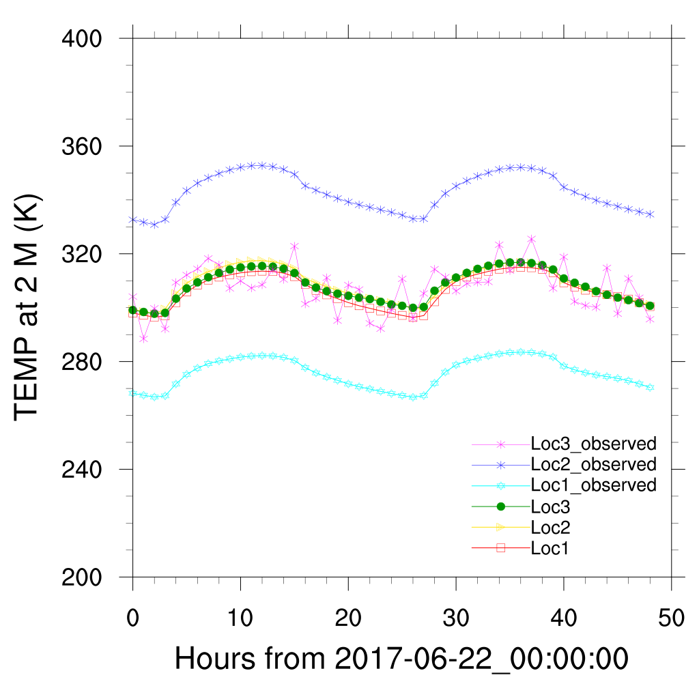

====================
Statistical Diagrams
====================

The extracted variables (by the PostWRF's EXTRACT section) can be accompanied by observation values, and used in
a couple of statistical diagrams. Time-series, scatter plots, and Taylor diagrams can be plotted by PostWRF. Except the time sereis,
the other two diagrams (scatter plots and Taylor diagrams), need both simulation (WRF) and observation values. Time series can 
be plotted by using only simulation values, without incorporating observations.

Example 1
=========

**Plotting time-series (can be simulations or observations) of the WRF output from some locations:**

Plotting time-series needs the WRF output extractions in some points. In other words, running the "DATA EXTRACTION" section of PostWRF is a prerequisite stage for the statistical section. The user can copy the simulation extractions (files started by "values") and change "values" to "observations" to make a new file with a name started by "observations". Afterwards, the user is supposed to update the new file and replace its values with observation values.

For example, suppose we have extracted T2 variable in 3 locations of Loc_1, Loc_2, and Loc_3, saved in a directory named outputs_postwrf_wrfout_d01_2017-06-21_18:00:00. The extracted file is named "values-T2-Bilinear". the observation file (provided by the user) will be a file named "observations-T2-Bilinear", with the exact structure of the copied file, but different values (observation values).

.. role:: raw-html(raw)
    :format: html

| \============= STATISTICAL DIAGRAMS \============== :raw-html:` `
| \=========================================== :raw-html:` `
| STATISTICAL_DIAGRAMS_ON_OFF    = 1

| Timeseries_ON_OFF              = 1
| Timeseries_Line_on_off         = 1
| Timeseries_Marker_on_off       = 1

| Scatterplot_ON_OFF             = 0

| Taylor_diagram_ON_OFF          = 0
| Taylor_labels_size             = 1
| Taylor_markers_size            = 0
| -------------------------------------------------------------------------------------------------

Minimum and maximum of the Y-axis can be specified while running the program.

Sample output image is as below:

   
   Timeseries diagram for 2m temperature on several locations (needs either simulations or observations)

Example 2
=========

**Scatter plot using the WRF output, and observations in some locations:**

| \============= STATISTICAL DIAGRAMS \============== :raw-html:` `
| \=========================================== :raw-html:` `
| STATISTICAL_DIAGRAMS_ON_OFF    = 1

| Timeseries_ON_OFF              = 0
| Timeseries_Line_on_off         = 1
| Timeseries_Marker_on_off       = 1

| Scatterplot_ON_OFF             = 1

| Taylor_diagram_ON_OFF          = 0
| Taylor_labels_size             = 1
| Taylor_markers_size            = 0
| -------------------------------------------------------------------------------------------------

Sample output image is as below:

   
   Scatter plot for 2m temperature on a specific location (needs both simulations and observations)

Example 3
=========

**Taylor Diagram using the WRF output, and observations in some locations:**

If several variable outputs are available, Taylor Diagram will be plotted with several models (represented as variables).

| \============= STATISTICAL DIAGRAMS \============== :raw-html:` `
| \=========================================== :raw-html:` `
| STATISTICAL_DIAGRAMS_ON_OFF    = 1

| Timeseries_ON_OFF              = 0
| Timeseries_Line_on_off         = 1
| Timeseries_Marker_on_off       = 1

| Scatterplot_ON_OFF             = 0

| Taylor_diagram_ON_OFF          = 1
| Taylor_labels_size             = 0.5
| Taylor_markers_size            = 0.5
| -------------------------------------------------------------------------------------------------

Sample output image is as below:

   Taylor diagram for 2m temperature on several locations (needs both simulations and observations)
